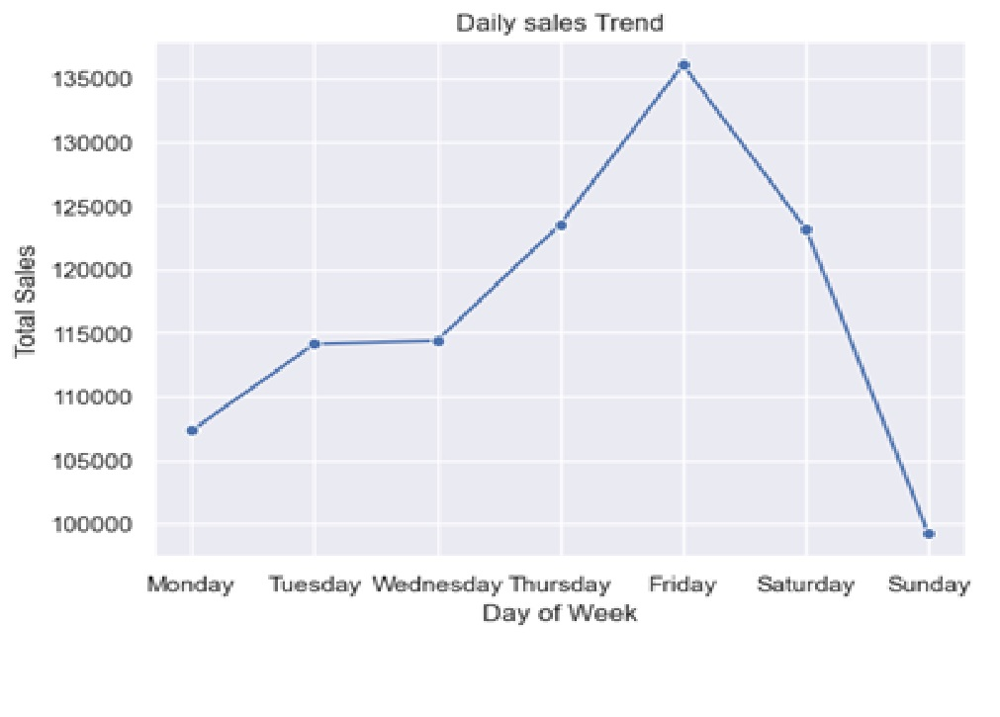
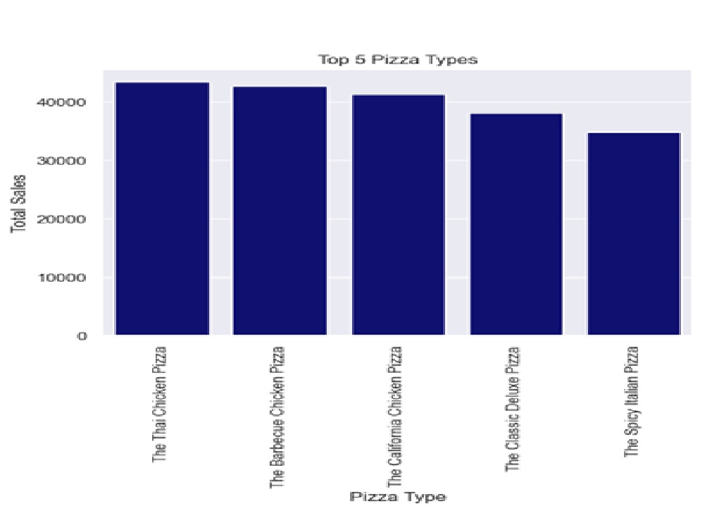
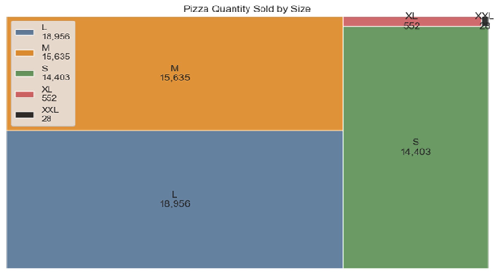

# PROJECT TITLE
# Pizza-Place-Sales
An Analysis of Pizza Place Sales data

## PROJECT OVERVIEW
This project analyzes a one year data of pizza orders of a fictional pizza restaurant using Python and Jupyter Notebook.  
The objective of this analysis is to uncover sales/revenue trends, best performing pizzas, customer purchasing patterns, and to generate business insights through exploratory data analysis (EDA).  


## DATASET
The dataset used for this analysis are four (4) csv files in a zip file.
Upon joining all four datasets into a single dataframe, the following columns were discovered.
- order_id
- date
- time
- order_details_id
- pizza_id
- quantity
- pizza_type_id
- size
- price
- name
- category
- ingredients
The dataset contained a single year of 48,620 records.


## BUSINESS QUESTIONS
- What is the total revenue/sales?
- Find the total quantity sold.
- Find the total orders.
- How many pizza types do they sell?
- Find the average price of the pizzas.
- What are the peak hours of sales?
- Find the total sales made on each day of the week. Which day of the week is when sales are made the most?
- Find the top 5 bestselling pizzas.
- Find the sales made in each month. Any trend noticeable?
- Are there pizza types that are not doing well on the menu?
- What are the most common order values?
- Which pizza sizes are the most frequently ordered?


## ANALYSIS PERFORMED
- Data wrangling
- Descriptive statistics
- Sales analysis
- Customer ordering behaviour
- Correlation analysis
- Data visualization


## TOOLS USED
- Python
- Pandas
- Matplotlib
- Seaborn
- Squarify
- Jupyter notebook


## KEY FINDINGS
- Most customers bought one pizza per order.
- Large pizza size was the most ordered pizza size by customers.
- Orders were placed mostly during afternoon and evening hours.
- Monthly sales trend showed fluctuations throughout the year with peak demand in July.
- Price and quantity have a strong relationship with sales/revenue.
- Time of the day had no effect on customer spending behaviour.


## BUSINESS RECOMMENDATIONS
The management of the pizza restaurant should:
- Make sure that their equipment, tools, as well ans human resources continue to support the ready supply of large pizza size.
- Target the successful handling of business operations during busy hours.
- Offer seasonal promotions especially during holidays in order to increase sales.
- Offer promotions targeting the least performing pizza sizes.
- Try to research and replicate the success of peak month sales in all other months.
- Try to drive sales during off-peak/less busy hours.


## VISUALIZATIONS
- Bar charts
- Line charts
- Scatter plot
- Box plot
- Heat map
- Tree map









## PRE-REQUISITES
- Python 3.11 or later
- JupyterLab or Jupyter Notebook
- Required Python libraries listed in `requirements.txt`


HOW TO RUN
1. Clone this repository:

```bash
git clone https://github.com/pg82647/Pizza-Place-Sales.git
```

2. Navigate to the project directory:
```bash
cd Pizza-Place-Sales
```

3. (Optional but recommended) Create and activate a virtual environment.
**Windows**

```bash
python -m venv .venv
.venv\Scripts\activate
```

**macOS/Linux**

```bash
python3 -m venv .venv
source .venv/bin/activate
```

4. Install the required dependencies:

```bash
pip install -r requirements.txt
```

5. Launch Jupyter Notebook or JupyterLab:

```bash
jupyter lab
```

or

```bash
jupyter notebook
```

6. Open the notebook:

```text
notebook/pizza_place_sales_analysis.ipynb
```

7. Run the notebook cells sequentially from top to bottom to reproduce the analysis and visualizations.


## REPOSITORY STRUCTURE
```text
Pizza-Place-Sales/
├── dataset/
│   ├── orders.csv
│   ├── order_details.csv
│   ├── pizzas.csv
│   └── pizza_types.csv
├── images/
│   ├── daily_sales_trend.jpg
│   ├── pizzas.jpg
│   └── sizes.jpg
├── notebook/
│   └── pizza_place_sales_analysis.ipynb
├── .gitignore
├── LICENSE
├── README.md
└── requirements.txt
```
.

## FUTURE IMPROVEMENTS
- Develop sales forecasting models.
- Analyze customer purchasing patterns in greater detail.
- Incorporate external factors such as holidays and weather into the analysis.


## AUTHOR
Etebom Ntuk  
[Github](https://github.com/pg82647)  
[LinkedIn](https://www.linkedin.com/in/ntuk-etebom/)


